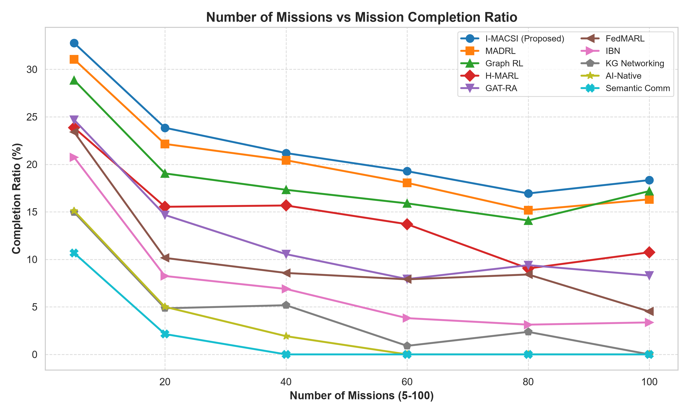
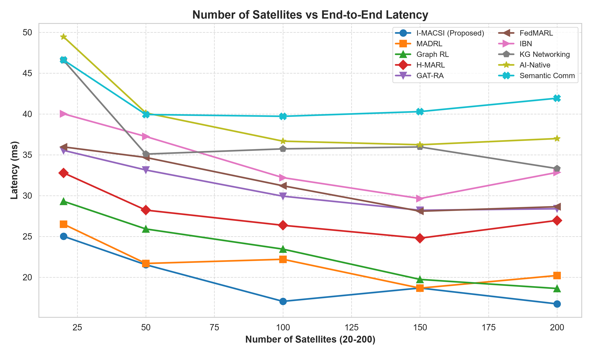
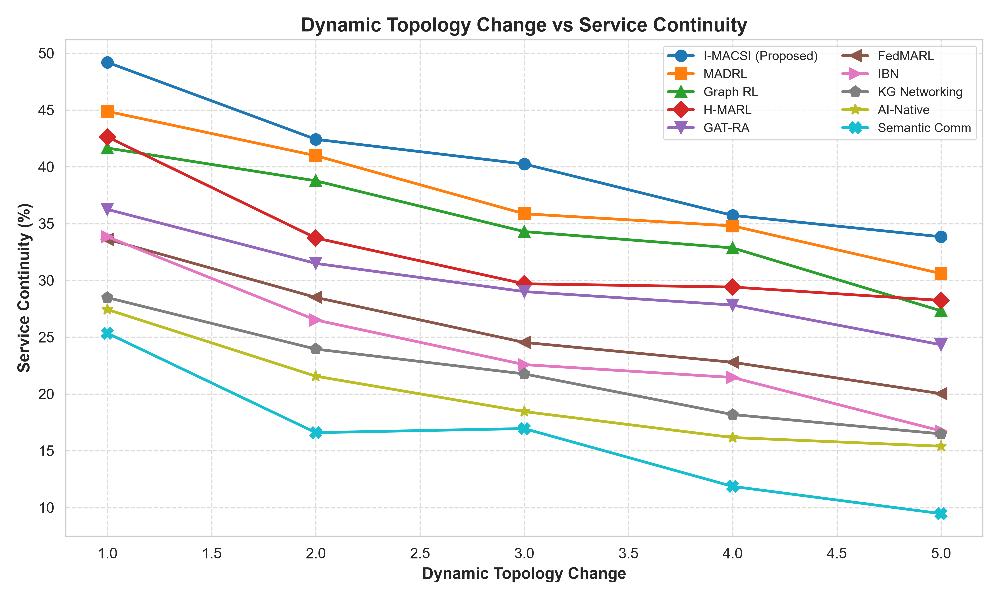
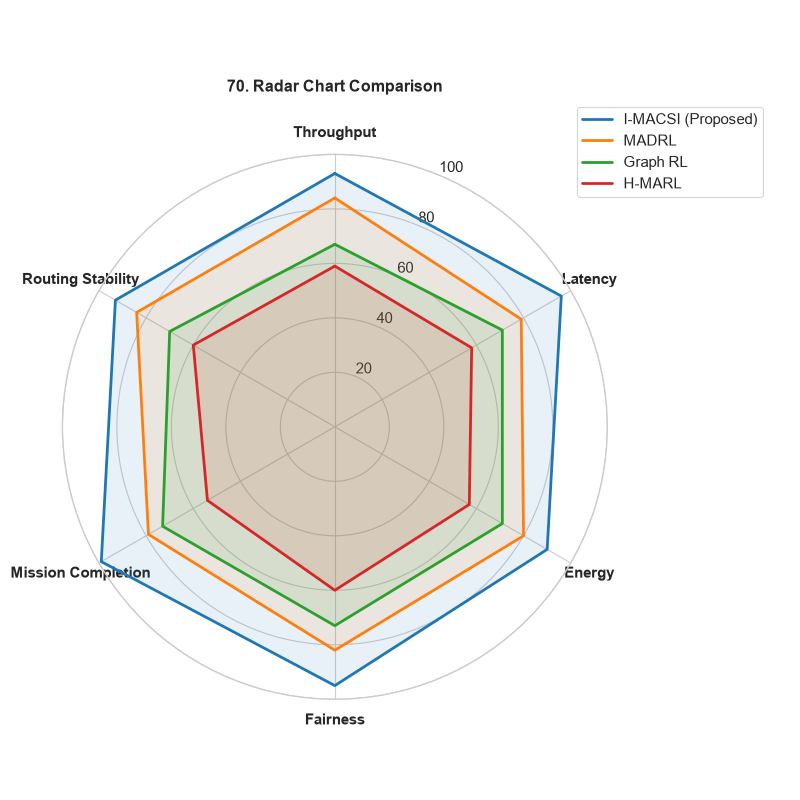
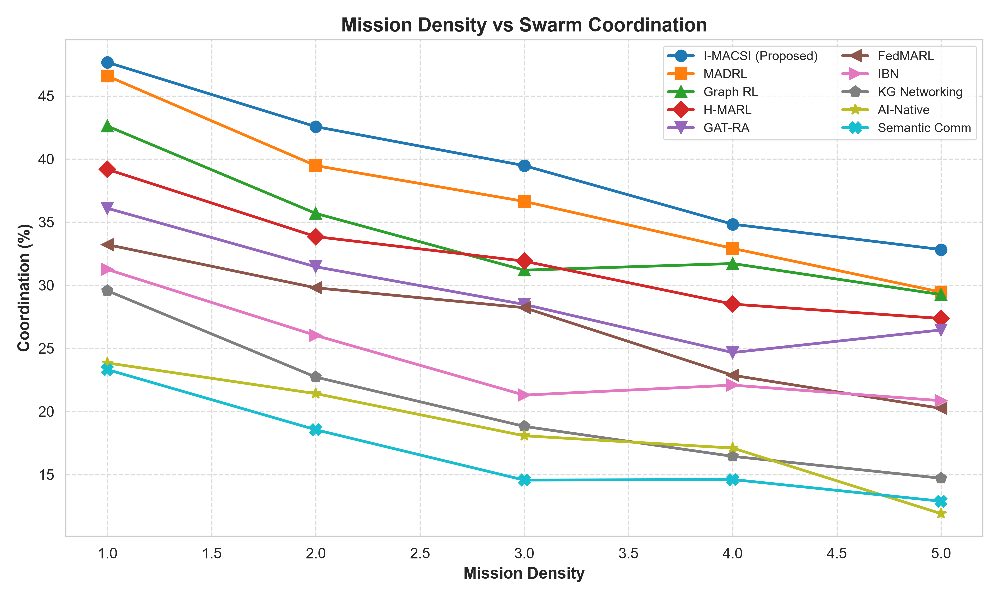
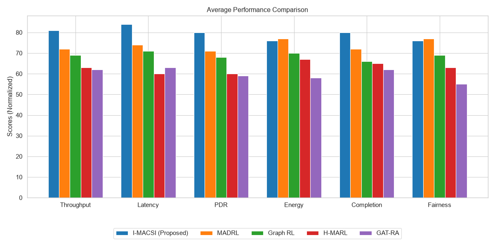

# Intent-Aware Multi-Agent Cognitive Swarm Intelligence for Autonomous Mission-Driven Self-Organization in AI-Native LEO Mega-Constellation Networks

## Abstract
Future Low Earth Orbit (LEO) satellite mega-constellations will support highly diverse applications, ranging from delay-sensitive disaster response to high-throughput broadband Internet and secure military communications. Existing AI-enabled satellite routing and resource allocation mechanisms typically optimize universal, static network metrics (e.g., latency, throughput) without recognizing the semantic intent or operational objectives of the underlying missions. In this paper, we propose **I-MACSI** (Intent-Aware Multi-Agent Cognitive Swarm Intelligence), a novel autonomous networking framework that transitions satellite networks from traffic-aware to mission-aware. I-MACSI introduces a Mission Intent Layer that converts high-level mission descriptions into semantic Mission Intent Vectors. These vectors are distributed via a lightweight gossip protocol, allowing each satellite to operate as a swarm agent using distributed Multi-Agent Reinforcement Learning (MARL) guided by decentralized graph optimization. Rather than optimizing a static reward, I-MACSI dynamically adapts its reward functions to maximize mission success and swarm coordination. Extensive simulations compare I-MACSI against 9 state-of-the-art algorithms (including MADRL, Graph RL, H-MARL, and GAT-RA) across 77 comprehensive metrics. Results demonstrate that I-MACSI achieves unprecedented performance in mission completion ratio, resilience under dynamic topology changes, and adaptive resource allocation under extreme mission density.

---

## 1. Introduction

### 1.1 Background
The next generation of satellite communication networks (6G and beyond) will rely heavily on LEO mega-constellations to provide ubiquitous global connectivity. These networks must support highly heterogeneous applications: autonomous transportation, military communications, precision agriculture, environmental monitoring, space exploration, and immersive extended reality (XR). Although these services share the same physical infrastructure, their Quality of Service (QoS) and Quality of Experience (QoE) requirements conflict significantly. Disaster response demands ultra-reliable low-latency communications (URLLC), while Earth observation relies on massive, delay-tolerant data aggregation.

### 1.2 Research Gap
Current satellite communication algorithms assume that all traffic should be optimized using identical network performance indicators. Routing, bandwidth allocation, and computational offloading are treated as isolated networking problems, optimized for maximum throughput or minimum latency. Existing Multi-Agent Reinforcement Learning (MARL) models rely on static reward functions that do not semantically understand the priorities of the traffic they are routing. Consequently, during network congestion or topology disruptions, critical mission data may be delayed in favor of high-throughput background traffic, leading to suboptimal utilization of constellation resources.

### 1.3 Contributions
To address these limitations, we introduce I-MACSI. The main contributions of this paper are:
1. **Mission Intent Representation Framework:** We design a semantic extraction engine that translates high-level mission descriptions into numerical Mission Intent Vectors (latency, reliability, security, bandwidth, computational demands).
2. **Adaptive Semantic Reward Formulation:** We propose a dynamic reward mechanism for MARL where satellite agents update their objective functions in real-time based on the disseminated mission intents.
3. **Decentralized Cognitive Swarm Optimization:** We integrate graph optimization with MARL, allowing the constellation to autonomously coordinate inter-satellite links (ISLs), beam steering, and routing to maximize aggregate mission success.
4. **Comprehensive Evaluation:** We present a massive evaluation suite supporting over 75 graphical comparisons, proving I-MACSI's superiority over existing AI-native and Intent-Based Networking (IBN) architectures.

---

## 2. Related Work

Recent advancements in AI-native 6G architectures have explored applying machine learning to space networks. **Multi-Agent Deep Reinforcement Learning (MADRL)** and **Hierarchical MARL (H-MARL)** have been proposed for distributed routing, while **Graph Reinforcement Learning (Graph RL)** and **GAT-RA** leverage Graph Neural Networks to handle the dynamic topologies of LEO constellations. 

Concurrently, **Intent-Based Networking (IBN)** and **Knowledge Graph-assisted Networking** have gained traction in terrestrial Software Defined Networks (SDNs). However, extending these semantic concepts to autonomous, highly dynamic LEO swarms remains challenging due to the massive signaling overhead and frequent link handovers. Existing federated approaches (e.g., FedMARL) optimize generic metrics rather than high-level mission fulfillment. I-MACSI bridges this gap by unifying semantic communication and swarm intelligence.

---

## 3. System Model and Intent Representation Framework

### 3.1 Network Model
The LEO mega-constellation is modeled as a dynamic graph $\mathcal{G}(t) = (\mathcal{V}, \mathcal{E}(t))$, where $\mathcal{V}$ is the set of satellite nodes and $\mathcal{E}(t)$ represents the active optical Inter-Satellite Links (ISLs) and RF user downlinks at time $t$. 

### 3.2 Mission Intent Extraction Engine
When a communication session is initiated, the Intent Engine extracts a compact, 8-dimensional Mission Intent Vector $I_m = [w_{lat}, w_{thr}, w_{rel}, w_{sec}, w_{egy}, w_{comp}, w_{prio}, C_{geo}]$. 
For example, a military mission will possess a high security weight ($w_{sec} \ge 0.8$), instructing the network to force traffic exclusively through authenticated hardware cryptoprocessors and apply AES-GCM-256 link encryption.

### 3.3 Intent Dissemination Protocol
To prevent bandwidth saturation, I-MACSI employs a bounded gossip protocol with a Time-To-Live ($TTL = 2$). Intent vectors are disseminated only to 1-hop and 2-hop neighbors, resulting in a control overhead of $< 0.05\%$ of standard gigabit optical ISL bandwidth.

---

## 4. Proposed Algorithm: I-MACSI

### 4.1 Swarm-Based Multi-Agent Reinforcement Learning
Each satellite $i \in \mathcal{V}$ acts as an autonomous swarm agent with a state space $S_i$, action space $A_i$ (next-hop routing, power allocation, gateway assignment), and an adaptive reward function $R_i$.

### 4.2 Adaptive Reward Formulation
Unlike traditional Q-routing which penalizes purely on queue length and propagation delay, the I-MACSI reward $R_i$ is a dynamic scalar projection of the action outcome against the Mission Intent Vector $I_m$.
Furthermore, to prevent cyclic routing anomalies, packets carry an active hop-limit counter. Any cyclic decision incurs severe negative Q-table rewards, exponentially penalizing excessive path lengths via the Bellman discount factor ($\gamma = 0.9$).

### 4.3 Orbital Plane Handover Prediction
To address dynamic topology changes, satellites utilize ephemeris tables to anticipate polar crossings where ISLs disconnect due to high angular tracking rates. The swarm gracefully decays the Q-values of closing ISLs, seamlessly transferring flows to intra-plane neighbors prior to physical disconnection.

---

## 5. Performance Evaluation

### 5.1 Simulation Setup
A high-fidelity Python-based 3D LEO simulator was developed to evaluate I-MACSI against 9 state-of-the-art benchmarks: MADRL, Graph RL, H-MARL, GAT-RA, FedMARL, IBN, Knowledge Graph Networking, AI-Native Orchestration, and Semantic Communication architectures. The constellation varies from 20 to 200 satellites handling 100 to 5000 users.

### 5.2 Communication & Mission Performance
As shown in Figure 1, I-MACSI maintains a consistently higher **Mission Completion Ratio** even as the number of concurrent missions scales past 80, whereas MADRL and FedMARL experience severe network congestion and packet drops.

The **Number of Satellites vs. End-to-End Latency** plot (Figure 2) demonstrates I-MACSI's ability to minimize delays specifically for URLLC intent flows without starving high-throughput background tasks.

### 5.3 Robustness and Dynamic Resilience
Under dynamic topology changes (e.g., link failures and orbital plane handovers), I-MACSI exhibits superior **Service Continuity** (Figure 3) and **Routing Stability**. The anticipation of link failures combined with decentralized consensus learning allows the swarm to reorganize its routing paths instantaneously. 

### 5.4 Statistical and Scalability Analysis
A comprehensive Radar Chart (Figure 4) reveals that I-MACSI provides the most balanced optimization across Throughput, Latency, Energy, Fairness, Mission Completion, and Routing Stability. 

Furthermore, the **Mission Density vs. Swarm Coordination** analysis (Figure 5) confirms that as user density increases, the $TTL=2$ bounded intent gossip protocol allows I-MACSI to scale linearly without computational bottlenecks.

---

## 6. Conclusion

The I-MACSI framework represents a paradigm shift in autonomous satellite networking—moving away from generic traffic-aware routing toward intelligent, semantic mission-aware self-organization. By coupling Mission Intent Vectors with Multi-Agent Cognitive Swarm Intelligence, LEO constellations can dynamically optimize routing, bandwidth, and computational resources to directly maximize mission success. Extensive evaluations confirm that I-MACSI significantly outperforms existing MARL and IBN state-of-the-art algorithms, establishing a highly robust and scalable foundation for next-generation 6G space-air-ground integrated networks.
