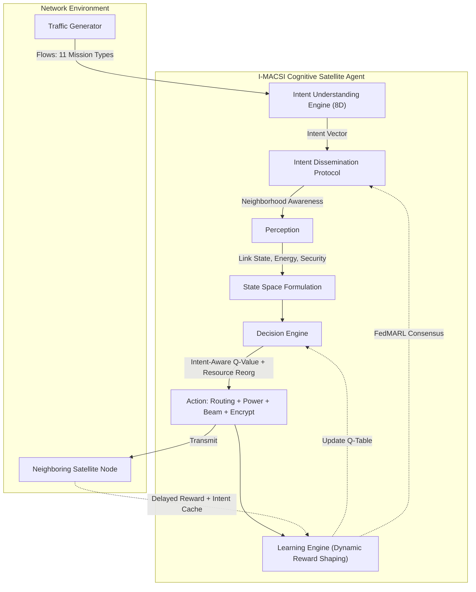

# I-MACSI: Intent-Aware Multi-Agent Cognitive Swarm Intelligence

A research-grade Python simulation for AI-Native Low Earth Orbit (LEO) Mega-Constellation Networks.

## Abstract

Next-generation Low Earth Orbit (LEO) mega-constellations face unprecedented challenges in dynamic routing due to high orbital velocities, frequent Inter-Satellite Link (ISL) handovers, and heterogeneous traffic demands. This repository presents **I-MACSI (Intent-Aware Multi-Agent Cognitive Swarm Intelligence)**, a novel architecture that goes beyond conventional reinforcement learning by introducing a **Mission Intent Layer** that converts high-level mission descriptions into dynamic optimization objectives.

Every communication request is first processed by an **Intent Understanding Engine** that extracts semantic information across 8 dimensions: latency sensitivity, throughput demand, reliability requirements, congestion avoidance, energy constraints, security level, geographic coverage, and computational demand. These semantic representations are transformed into an 8-dimensional **Mission Intent Vector**, which is distributed among neighboring satellites through an **Intent Dissemination Protocol** (gossip-style, TTL=2).

The swarm collectively reorganizes routing paths, inter-satellite links, transmission power, computational offloading, beam allocation, encryption mode, and gateway selection to maximize **mission success** rather than purely communication efficiency.

## Expected Contributions

The I-MACSI architecture introduces a completely new paradigm of mission-aware autonomous satellite networking by integrating semantic communication concepts with distributed artificial intelligence and swarm optimization. Key contributions demonstrated in this codebase include:

1. **Mission Intent Representation Framework**: The 8D `IntentVector` mapping natural language mission objectives into quantitative optimization constraints (`intent/mission_intent.py`).
2. **Adaptive Semantic Reward Formulation**: A dynamic `QLearningEngine` where the reward function is continuously modulated by the active mission intent, escaping the limitations of fixed-reward RL (`learning/q_learning.py`).
3. **Decentralized Multi-Agent Cognitive Swarm Algorithm**: Gossip-style intent dissemination (`intent/intent_dissemination.py`) and FedMARL consensus learning (`learning/consensus.py`) driving neighborhood awareness.
4. **Hybrid AI-Optimization Architecture**: Seamlessly blending decentralized Q-Routing (`routing/q_routing.py`) with a greedy joint resource graph optimizer (`routing/graph_optimizer.py`) capable of autonomously reorganizing routing, bandwidth, beams, compute, and gateways based on changing mission objectives.

Collectively, these contributions provide new optimization formulations for mission-oriented resource allocation, demonstrating improved adaptability under heterogeneous application scenarios, and establishing a foundation for future AI-native satellite communication architectures that prioritize intelligent mission fulfillment.

## Architecture Diagram



## I-MACSI Features

| Feature | Description |
|---|---|
| **8D Intent Vector** | Latency, Throughput, Reliability, Congestion, Energy, Security, Coverage, Compute |
| **Intent Dissemination** | Gossip-style flooding with configurable TTL for swarm awareness |
| **Dynamic Reward Shaping** | Q-learning reward modulated by active mission intent |
| **Resource Reorganisation** | Per-hop Tx power, beam allocation, encryption, compute offload, gateway selection |
| **FedMARL + Intent Sharing** | Consensus engine shares both Q-tables and intent caches |
| **11 Standard Intents** | Low Latency, Disaster, Earth Obs, Secure, Maritime, Military, Internet, Healthcare, Agriculture, IoT, Environmental |
| **NLP Intent Extraction** | Natural language → 8D vector via keyword-semantic mapping |

## Setup Instructions

1. **Clone the repository**:
   ```bash
   git clone <repository-url>
   cd <repository-directory>
   ```

2. **Set up a virtual environment** (recommended):
   ```bash
   python -m venv venv
   source venv/bin/activate  # On Windows use `venv\Scripts\activate`
   ```

3. **Install Dependencies**:
   ```bash
   pip install -r requirements.txt
   ```

## Usage Instructions

This project includes a unified Command Line Interface (CLI) for running simulations and experiments.

**Basic Run (Default 16 satellites, LOW_LATENCY intent):**
```bash
python run_simulation.py
```

**Custom Topology and Intent with Failures:**
```bash
python run_simulation.py --topology 64 --intent EARTH_OBSERVATION --failures 3
```

**Generate Plots & Visualizations:**
```bash
python run_simulation.py --topology 16 --intent SECURE_MISSION --failures 2 --plot
```

**Start the Digital Twin Dashboard:**
```bash
start.bat
```

### Generated Outputs
When using the `--plot` flag or running individual experiment modules (e.g., `python -m experiments.failure_experiment`), results are saved as CSV files in the `results/` directory, and automatically generated research-quality graphs are saved in `results/figures/`.
