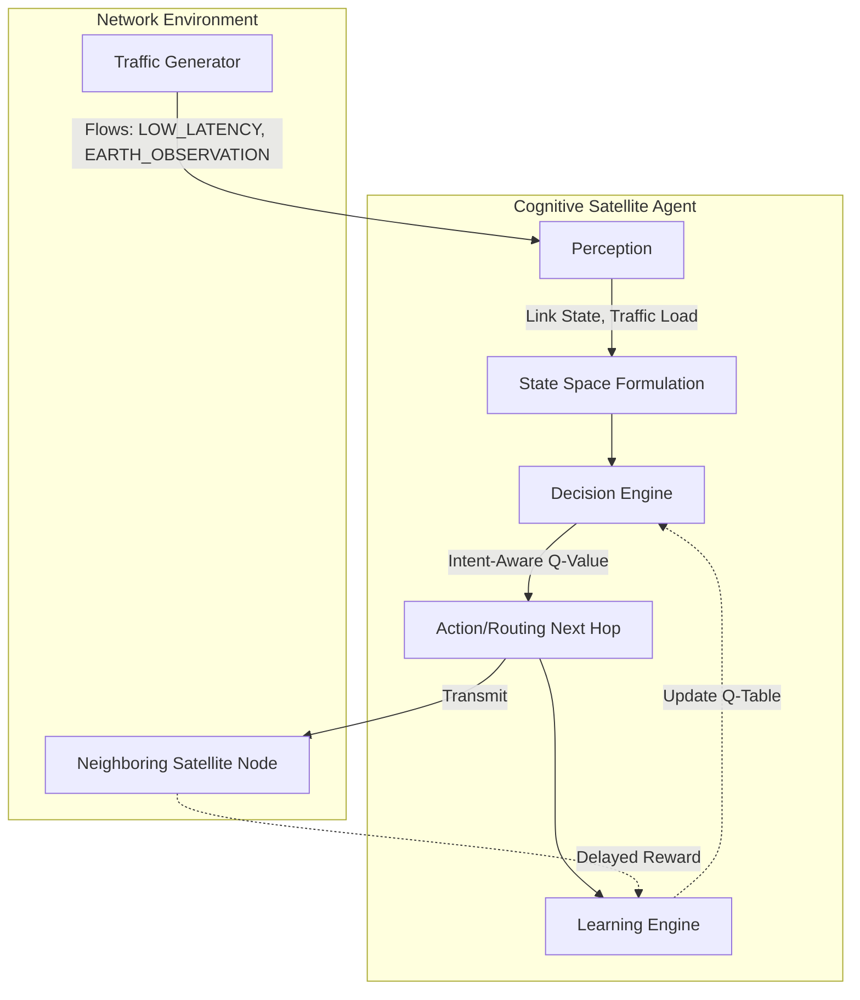

# Intent-Aware Multi-Agent Cognitive Swarm Q-Routing

A research-grade Python simulation for AI-Native Low Earth Orbit (LEO) Mega-Constellation Networks.

## Abstract

Next-generation Low Earth Orbit (LEO) mega-constellations face unprecedented challenges in dynamic routing due to high orbital velocities, frequent Inter-Satellite Link (ISL) handovers, and heterogeneous traffic demands. This repository presents an **Intent-Aware Multi-Agent Cognitive Swarm Q-Routing** architecture. We model each satellite as an autonomous cognitive agent utilizing distributed Q-learning. By augmenting traditional Q-routing with mission-intent cost functions (e.g., Low Latency, High Throughput, Resilience), the swarm autonomously self-organizes and adapts its routing policies in real-time. Experimental evaluations demonstrate the architecture's capability to maintain high Packet Delivery Ratios (PDR) and rapidly recover from catastrophic ISL failures, outperforming static Dijkstra routing paradigms under dynamic network stress.

## Architecture Diagram



## Setup Instructions

1. **Clone the repository**:
   ```bash
   git clone <repository-url>
   cd <repository-directory>
   ```

2. **Set up a virtual environment** (recommended):
   ```bash
   python -m venv venv
   source venv/bin/activate  # On Windows use `venv\Scripts\activate`
   ```

3. **Install Dependencies**:
   ```bash
   pip install -r requirements.txt
   ```

## Usage Instructions

This project includes a unified Command Line Interface (CLI) for running simulations and experiments.

**Basic Run (Default 16 satellites, LOW_LATENCY intent):**
```bash
python run_simulation.py
```

**Custom Topology and Intent with Failures:**
```bash
python run_simulation.py --topology 64 --intent EARTH_OBSERVATION --failures 3
```

**Generate Plots & Visualizations:**
```bash
python run_simulation.py --topology 16 --intent SECURE_MISSION --failures 2 --plot
```

### Generated Outputs
When using the `--plot` flag or running individual experiment modules (e.g., `python -m experiments.failure_experiment`), results are saved as CSV files in the `results/` directory, and automatically generated research-quality graphs are saved in `results/figures/`.
