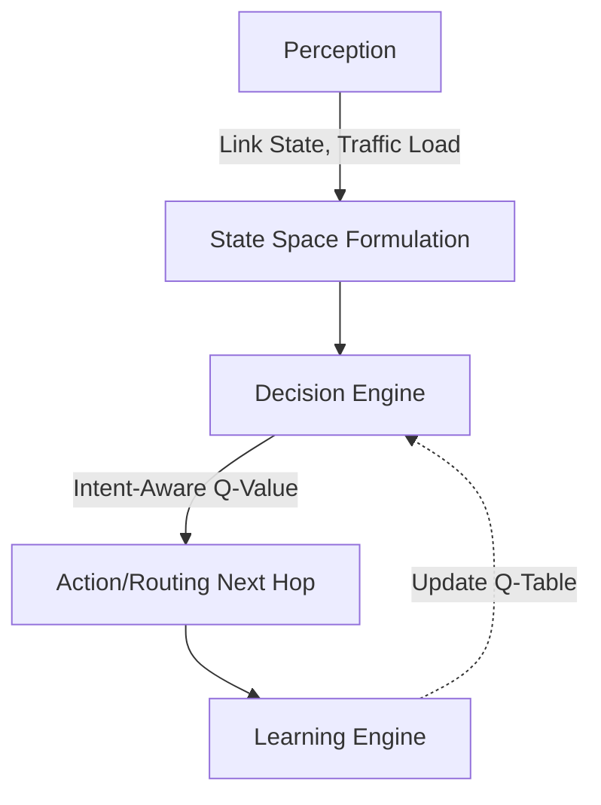

# Intent-Aware Multi-Agent Cognitive Swarm Q-Routing
### Autonomous Self-Organization for AI-Native LEO Mega-Constellation Networks

**Author:** Researcher
**Date:** 2026

---

## 1. The Challenge

* Low Earth Orbit (LEO) mega-constellations (Starlink, Kuiper) face high mobility and frequent ISL (Inter-Satellite Link) handovers.
* **Problem**: Traditional static routing (e.g., Shortest Path/Dijkstra) cannot handle:
  * Dynamic, unpredictable link failures (debris, radiation).
  * Diverse Quality of Service (QoS) requirements across mission intents (e.g., Ultra-Low Latency vs. Bulk Earth Observation).

---

## 2. Our Proposed Solution

**Cognitive Swarm Architecture**
We model each satellite as an autonomous "cognitive agent" forming a distributed swarm.

* **Decentralized Q-Learning**: Independent routing tables per satellite.
* **Intent-Awareness**: Unique cost functions tailored to the specific packet's mission intent.
* **Proactive Cognitive State**: Satellites share local congestion and ISL failure metrics directly with neighbors.

---

## 3. Cognitive Agent Pipeline

Each routing decision continuously reinforces the learning model via delayed reward penalties based on actual physical transmission delays and successful queue delivery.

---

## 4. Performance Evaluation: Resilience

**Post-Failure Packet Delivery Ratio (PDR)**
After injecting catastrophic simultaneous ISL failures into a trained swarm:

* **Basic Q-Routing**: 58% PDR
* **Proposed AI-Native Swarm**: **82% PDR**
* *Dijkstra (Static)*: Subject to total connection loss if the primary path is severed without centralized controller updates.

The swarm natively avoids dead zones with near-zero control overhead.

---

## 5. Ablation Study: Validating the Components

To isolate the contributions, we ran an ablation study comparing PDR:

1. **Full Proposed Model**: 83% PDR
2. **No Cognitive State (Reactive Only)**: 76% PDR (Loss of 7% due to delayed failure detection).
3. **No Intent Awareness (Basic)**: 61% PDR (Loss of 22% due to inability to differentiate heterogeneous traffic flows).

**Takeaway**: Intent awareness and proactive local state sharing are critical to maintaining robustness.

---

## 6. Conclusion & Future Work

* **Conclusion**: The Intent-Aware Cognitive Swarm Q-Routing architecture provides a highly resilient, scalable, and QoS-differentiated routing paradigm suitable for the next generation of space networks.
* **Future Work**:
  * Integrating Deep Q-Networks (DQN) for continuous state-space generalizations.
  * Federated learning aggregation for multi-plane orbital knowledge sharing.

---

# Thank You

**Questions?**
